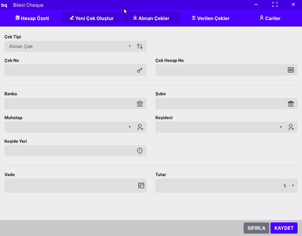

# Bilexi Cheque
## Açıklama
SPA formatında yazılmış basit uygulama. Dashboard, input form ve girdilerin listelenmesini sağlayan 5 ana ekrandan oluşur. 
## Neler kullanıyor?
* Electron.js
* Node.js
* Vue.js (Vuex, Router)
* Babel
* Webpack
* SQLite 3
*  Bazı NPM pluginleri

## Çalıştırma

 * `npm install`  
 * `npm run transpile` 
 * `npm run build`  
 * `npm run start`  
 

## Önizleme

